## 一、引论

### 冯诺依曼模型

1. 将计算机硬件分为**4**个子系统：内存、算术逻辑单元、控制单元、输入/输出

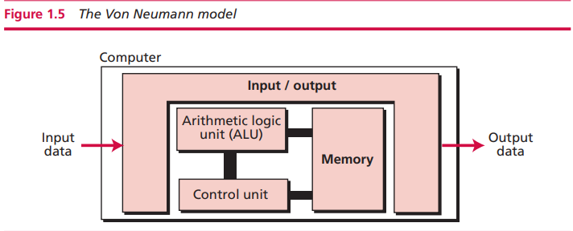

2. 存储程序

程序和数据应具有相同的格式，都存储在**内存**中

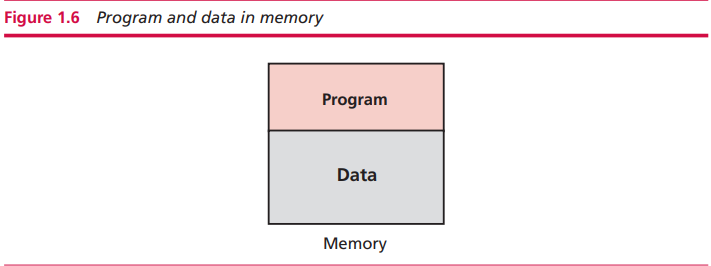

3. 指令**顺序**执行

### 计算机组件

1. 计算机**硬件**
2. **数据**
3. 计算机**软件**

### 关键术语

|        术语        |     释义      |
| :----------------: | :-----------: |
|        ALU         | 算术逻辑单元  |
| integrated circuit |   集成电路    |
|   Turing machine   |    图灵机     |
| von Neumann model  | 冯·诺依曼模型 |

------

## 五、计算机组成

### 中央处理单元(CPU)

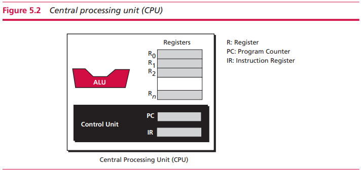

CPU执行发生在数据上的操作。在大多数架构中，CPU包括3个部分：

#### 1.算术逻辑单元

逻辑运算、移位运算、算术运算

#### 2.寄存器

- 数据寄存器：计算机使用大量在CPU内部的寄存器来保留中间结果来加速操作
- 指令寄存器：CPU负责从内存中一个一个地取出指令并存储在IR中，译出指令并执行
- 程序计数器：PC跟踪目前正在被执行的指令。在每次指令执行后，计数器自增以指向在内存中的下一条指令

#### 3.控制单元

由控制单元向其他子系统发送信号以控制各个子系统的操作

### 主存

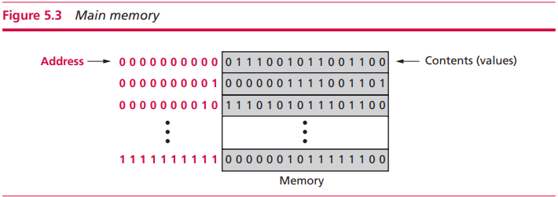

#### 1.RAM

计算机中主存的大部分由RAM组成。在RAM中，数据可以根据地址随机访问而不需要访问位于该数据前面的内容(ROM也可以随机访问)。ROM和RAM的区别在于CPU可以向RAM写数据并且之后再重写，并且RAM是易失性的：当计算机断电时，信息会丢失

#### 2.ROM(read-only memory)

ROM的内容由制造商写入，CPU可以读取但不能向其写入。ROM的优势在于它是非易失性的。例如，ROM持有**引导程序(boot program)**

#### 3.分级存储体系

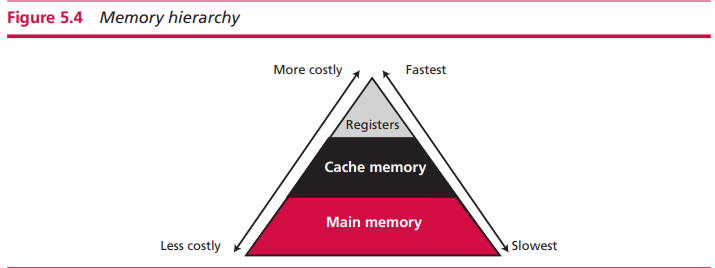

#### 4.缓存

缓存很小但如此有效的原因在于"80-20法则"：大多数的计算机基本上花费了80%的时间访问仅仅20%的数据

### 输入/输出

| 非存储设备 | 存储设备 |
| :--------: | :------: |
|    键盘    |   磁盘   |
|    鼠标    |   磁带   |
|   显示器   | CD-ROMs  |
|   打印机   |   DVD    |

### 子系统的互连

#### 1.CPU和内存互连

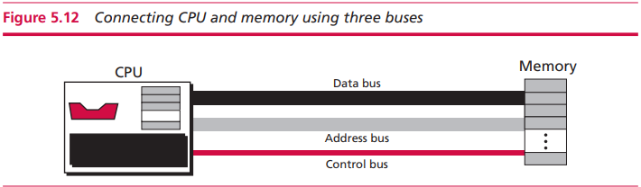

- 数据总线：连接的数量取决于字(word)的大小，如果一个字有32bits，那么我们需要32个连接以使一个字的信息能在同一时间传输
- 地址总线：地址总线允许访问内存中特定的一个字。连接的数量取决于内存的地址空间。如果内存有$$2^n$$个字，那么就需要n个连接
- 控制总线：控制总线承担CPU和内存的交流。连接的数量取决于计算机需要的控制命令的数量。如果计算机有$$2^m$$个控制动作，那么我们需要m个连接

#### 2.I/O设备互连

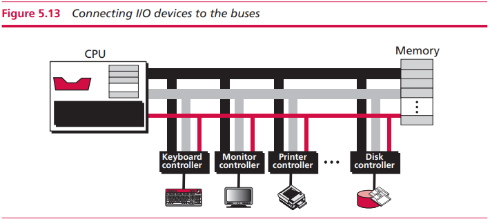

I/0设备不能直接连接到用于连接CPU和内存的总线上，因为I/O设备本质上机电、电磁设备或光学器件而CPU和内存是电子设备。又I/O设备的速度比CPU和主存更慢所以需要某种媒介来处理这种差异，因此I/O设备通过I/O控制器或者接口连接到总线上。每个I/O设备都有一个特定的控制器。

#### 3.控制器

控制器或者接口填补了I/O设备与CPU及内存之间本质的差异。一个控制器可以是串行或者并行的设备。串行控制器只有1个数据线，而平行控制器有多条数据连接以使在同一时间传输多个bit。

- SCSI(small computer system interface)

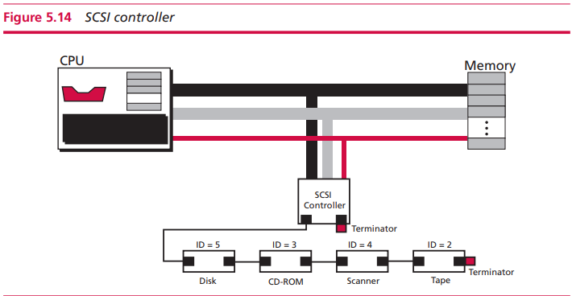

- FireWire

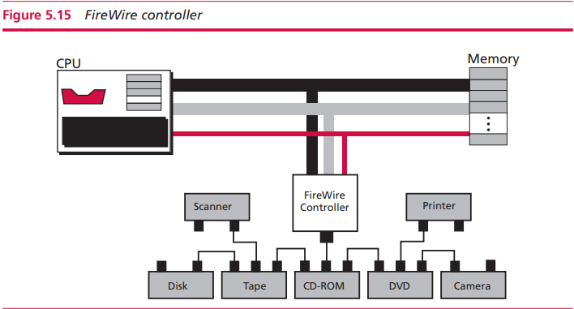

- USB(Universal Serial Bus)

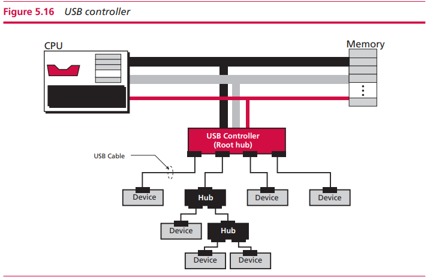

- HDMI

#### 4.I/O设备寻址

I. Isolated I/O

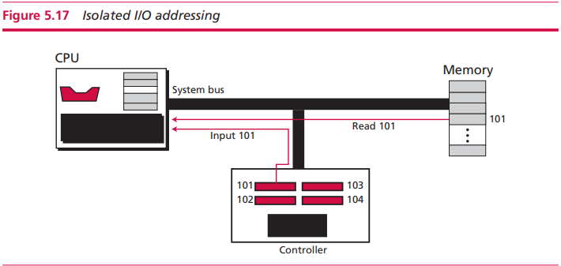

在这种寻址方式中，用于读取和写内存的指令与读取和写I/O设备的指令完全不同。每个I/O设备都有自己的地址，可以与内存地址重叠，且没有任何模糊性，因为指令是不同的。

II. 内存映射I/O

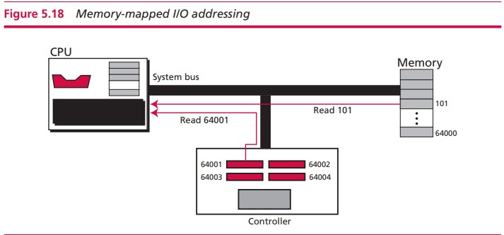

CPU将I/O控制器中的每个寄存器视作一个字(word)。即CPU没有单独用于I/O设备和内存传输数据的指令。该方法的优势在于只用配置少量的指令：I/O设备可以使用所有的内存指令。劣势在于部分内存地址空间分配给在I/O控制器中的寄存器。

### 程序执行

### 关键术语

|       术语        |    释义     |
| :---------------: | :---------: |
| compact disk(CD)  |    光盘     |
|   magnetic disk   |    磁盘     |
|   magnetic tape   |    磁带     |
|    master disk    |    主盘     |
| memory mapped I/O | 内存映射I/O |
|      monitor      |   显示器    |

