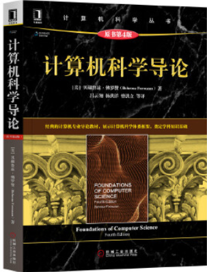
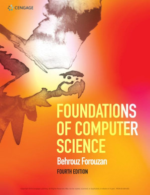

**New**✨：笔记发布在<a href="Notes/notes.md">这里</a>

## 如何使用

- <a href="Quizzes/">Quizzes</a>文件夹存放了每章后的**交互式测验题**及答案

- <a href="Solutions">Solutions</a>文件夹存放了每章节后**奇数**编号的**复习题**和**练习题**的答案

- <a href="Textbook">Textbook</a>文件夹存放了**英文原版教材PDF**

------

## 参考教材

|                     教材                     |                             图片                             |
| :------------------------------------------: | :----------------------------------------------------------: |
|                计算机科学导论                |   |
| Foundations of Computer Science, 4th Edition |  |

